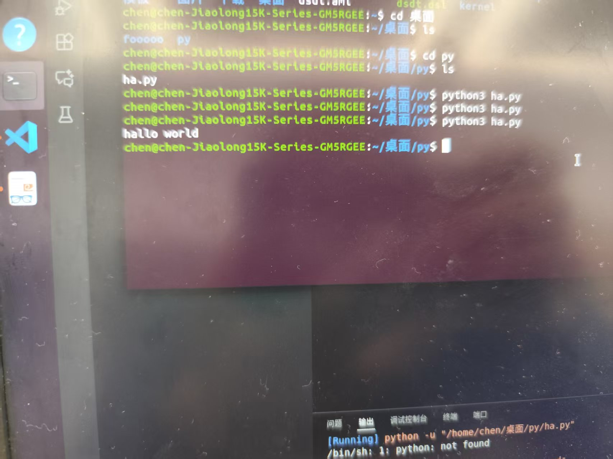
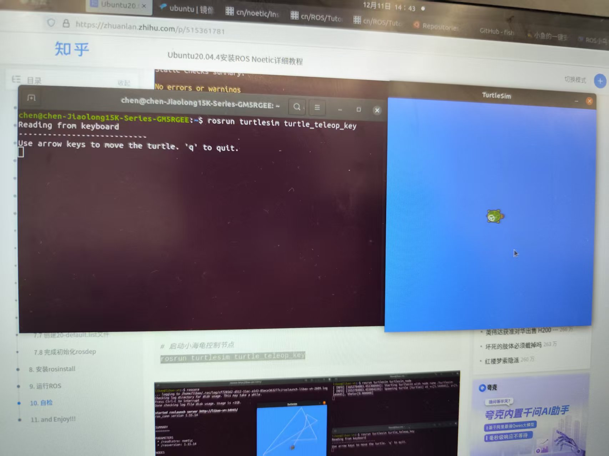
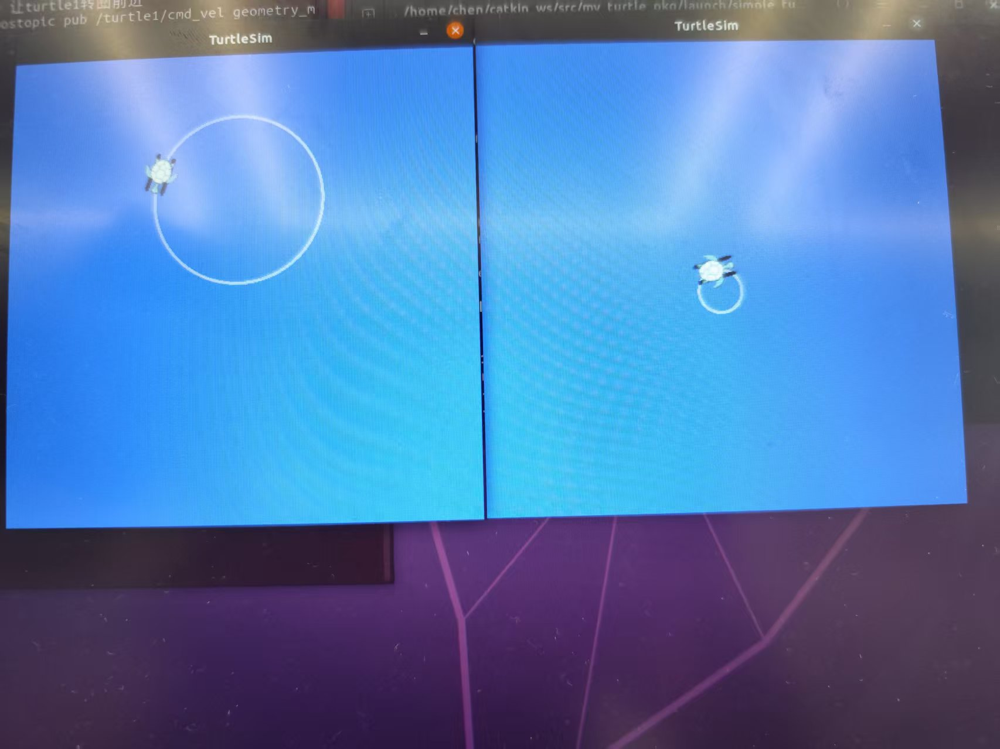

#week1 实验报告
1.实验任务：练习Linux 基础命令，练习Python编程练习，ROS1 安装验证，小乌龟和多乌龟。
2.实现过程
 >首先回顾了Linux的文件系统结构，在终端中逐一练习了ls、cd、mkdir、chmod等常用指令，熟悉了命令行的操作逻辑。
 >随后在VSCode中配置好Python环境，编写了几个基础的Python脚本，熟悉语法和逻辑控制。
 
 >接着查阅ROS官网和国内镜像源的教程，配置sources.list和密钥。因为网络原因，选择了国内的源进行下载安装。安装ros-noetic-desktop-full版本，并配置环境变量。
 
 >最后进行验证，在终端输入roscore启动核心，新开终端运行turtlesim节点呼出小乌龟模拟器，并通过键盘控制节点让小乌龟移动
 和画圈
 在此基础上，通过调用服务（service）生成了第二只乌龟，并尝试编写launch文件同时启动多个节点。
 
 以及对比。
3.遇到的问题及解决
 >在执行rosdep init和rosdep update时，总是报错提示网络连接失败。解决：通过查阅资料，改用手机热点，并使用了国内镜像网站替代原版海外网，成功更新。
 >在控制多乌龟时，发现键盘只能控制其中一只，另一只不动。解决：检查了话题（Topic）列表，发现需要将键盘控制发布的话题重映射到第二只乌龟对应的cmd_vel上。

4.总结与心得

  >ros系统总体来说十分复杂，我们的工作仅仅是入门的程度。但是感受到了它对于运行轨迹的控制非常好用，应该在之后的路径规划和控制中有很大的作用。同时，有很多问题都是许多人碰到过的，我们可以在许多论坛上查询问题的解决方式。
